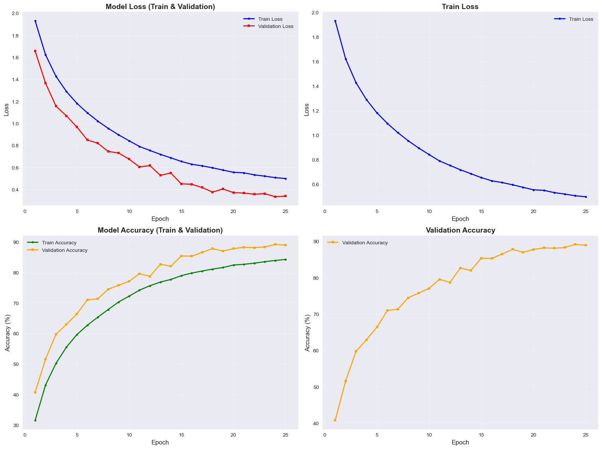
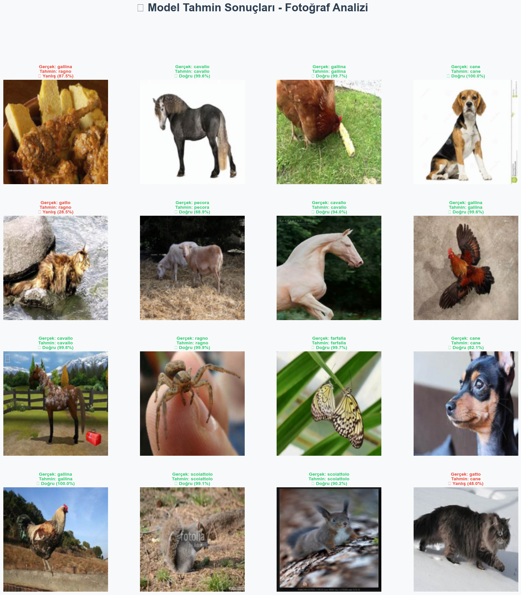
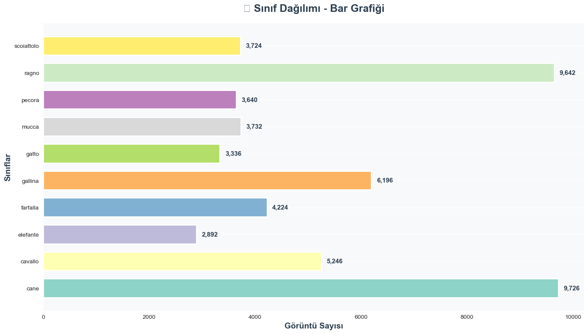
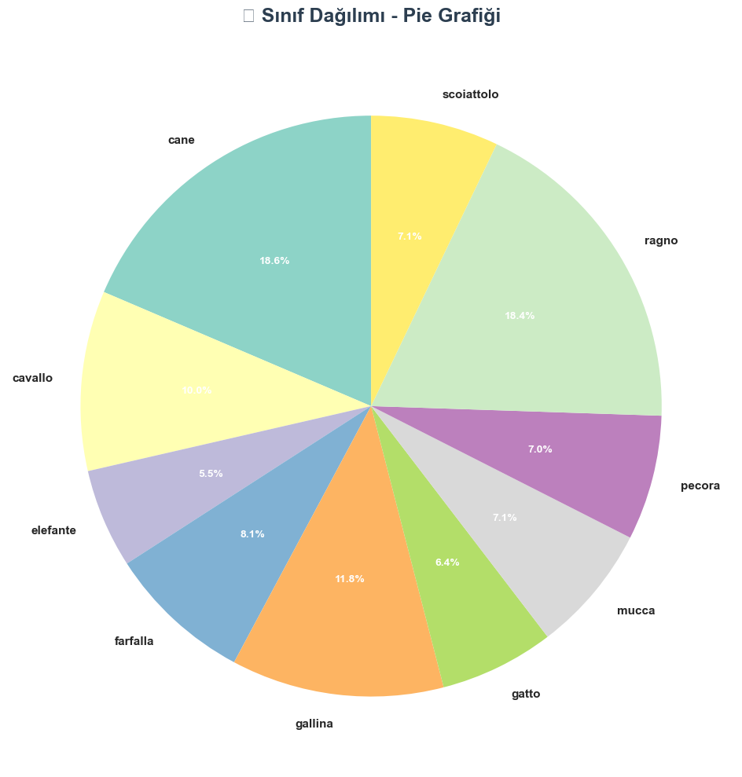
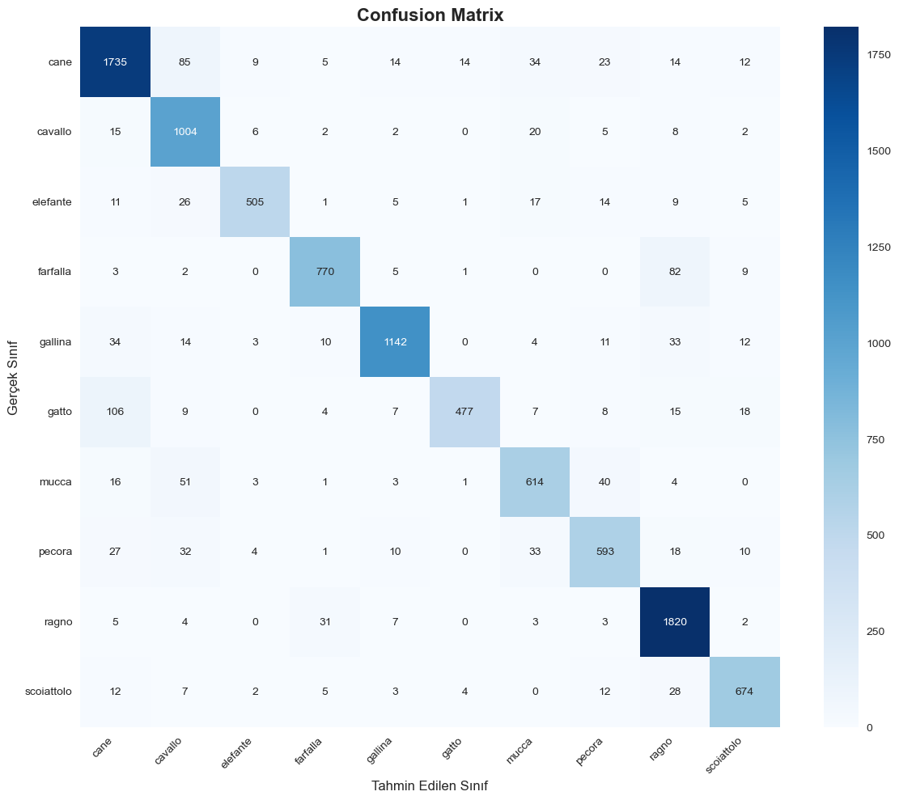
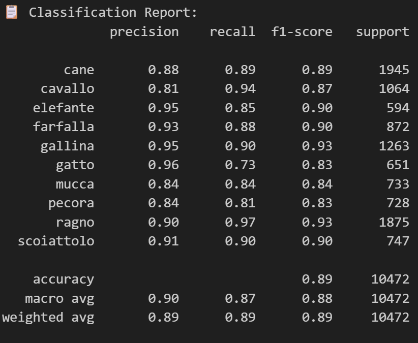

<div align="center">

# CNN (Convolutional Neural Networks) - Evrişimli Sinir Ağları Projesi

### PyTorch ile Görüntü Sınıflandırma | Hayvan Tanıma Modeli

**Modern CNN mimarisi ile 10 sınıflı hayvan görüntü sınıflandırma projesi**

[ Hızlı Başlangıç](#-hızlı-başlangıç) • [Özellikler](#-proje-özellikleri) • [ Model Mimarisi](#️-model-mimarisi) • [ Sonuçlar](#-sonuçlar) • [Görselleştirmeler](#-görselleştirmeler)

---

</div>

##  Projem Hakkında

Merhaba!  Bu proje, **PyTorch** kütüphanesi kullanılarak **Convolutional Neural Network (CNN)** ile görüntü sınıflandırma işlemini gerçekleştiren kapsamlı bir derin öğrenme projesidir. CNN'ler, özellikle görüntü işleme ve bilgisayarlı görü alanında yaygın olarak kullanılan derin öğrenme modelleridir.

Bu projede, **10 farklı hayvan sınıfını** (köpek, kedi, at, fil, kelebek, tavuk, inek, koyun, örümcek, sincap) ayırt edebilen bir model eğitiyoruz. Proje, başlangıç seviyesinden ileri seviyeye kadar herkesin anlayabileceği şekilde adım adım açıklanmıştır.

###  Bu Projede Öğrenecekleriniz

| Konu | Açıklama |
|------|----------|
|  **CNN Mimarisi** | Evrişimli katmanların nasıl çalıştığını ve görüntülerden özellik çıkarma sürecini sinir katmanalarını daha iyi anlamış olacak ve  öğreneceksiniz |
|  **PyTorch Kullanımı** | PyTorch ile model oluşturma, eğitme ve değerlendirme işlemlerini yapmayı öğreneceksiniz |
|  **Veri Ön İşleme** | Görüntü verilerinin hazırlanması ve augmentation tekniklerini uygulayacaksınız |
|  **Model Optimizasyonu** | Hız ve doğruluk dengesini sağlama tekniklerini öğreneceksiniz |
|  **Model Değerlendirme** | Accuracy, Loss, Confusion Matrix gibi metriklerin nasıl hesaplandığını göreceksiniz |
|  **Görselleştirme** | Model tahminlerini ve sonuçları görsel olarak analiz etmeyi öğreneceksiniz |

---

##  Proje Özellikleri

<div align="center">

###  Temel Özellikler

</div>

| Özellik | Açıklama |
|---------|----------|
| **Hedef Accuracy** | **%90+** doğruluk oranı hedefleniyor - Model oldukça başarılı! |
| **Hızlı Eğitim** | Optimize edilmiş batch size (128) ve görüntü boyutu (160x160) ile hızlı eğitim |
| **Modern Mimari** | 6 Conv2d katmanı, BatchNorm, Dropout, Global Average Pooling ile güçlü mimari |
| **Otomatik İndirme** | KaggleHub ile veri seti otomatik indirilir - Hiç uğraşmadan hazır! |
| **Data Augmentation** | Random Flip, Rotation, ColorJitter ile overfitting önleme |
| **Mixed Precision** | GPU varsa otomatik FP16 eğitimi (2x hız kazanımı!) |
| **Early Stopping** | Overfitting önleme ve zaman tasarrufu - Model kendini durduruyor |
| **Model Checkpoint** | En iyi model otomatik kaydedilir - `best_model.pth` dosyası |
| **Görselleştirme** | Fotoğraf analizi, bar/pie grafikleri, confusion matrix ile detaylı analiz |

---

## Kullanılan Veri Seti

<div align="center">

### Animals-10 Dataset

</div>

| Özellik | Değer |
|---------|-------|
| **Dataset** | `alessiocorrado99/animals10` |
| **Sınıf Sayısı** | **10 sınıf** |
| **Toplam Görüntü** | **52,358 görüntü** |
| **Sınıflar** | Köpek, Kedi, At, Fil, Kelebek, Tavuk, İnek, Koyun, Örümcek, Sincap |
| **Kaynak** | KaggleHub (otomatik indirme) |
| **Train/Val Split** | %80 Eğitim, %20 Doğrulama |

###  Veri Dağılımı

```
Sınıf Başına Görüntü Sayıları:
  Köpek (cane):      9,726 görüntü  (18.6%)
  At (cavallo):       5,246 görüntü  (10.0%)
  Fil (elefante):     2,892 görüntü  (5.5%)
  Kelebek (farfalla): 4,224 görüntü  (8.1%)
  Tavuk (gallina):    6,196 görüntü  (11.8%)
  Kedi (gatto):       3,336 görüntü  (6.4%)
  İnek (mucca):       3,732 görüntü  (7.1%)
  Koyun (pecora):     3,640 görüntü  (7.0%)
  Örümcek (ragno):    9,642 görüntü  (18.4%)
  Sincap (scoiattolo): 3,724 görüntü  (7.1%)
```

>  **Not:** Veri seti dengeli değil, bazı sınıflar daha fazla görüntüye sahip. Bu durum model eğitimini etkileyebilir, ancak data augmentation ile bu sorunu minimize ediyoruz.

---

##  Model Mimarisi

<div align="center">

###  CNN Katman Yapısı

</div>

```
1. Giriş ve İlk Özellik Çıkarımı (Blok 1): Görüntüyü modele verdiğimiz ilk aşamada, 3 renk kanalını alıp doğrudan 64 kanala çıkarıyoruz. Burada boyutu biraz düşürüp işlem yükünü azaltmak için "Stride=2" kullandım. Eğitim daha kararlı ilerlesin diye her conv işleminden sonra mutlaka Batch Normalization ve ReLU aktivasyonunu ekledim. Bloğun sonunda, hem boyutu küçültmek hem de modelin ezberlemesini (overfitting) engellemek için Max Pooling ve Dropout katmanlarını devreye soktuk.

2. Derinleşme Aşaması (Blok 2): Modelin biraz daha karmaşık detayları öğrenmesi için ikinci blokta kanal sayısını 64’ten 128’e yükselttim. Yapı olarak ilk blokla benzer ilerliyor; yine stride ile boyut düşürme, ardından normalizasyon ve aktivasyon işlemleri var. İkinci bir 128’lik evrişimden sonra yine havuzlama (pooling) yaparak veriyi bir sonraki aşamaya hazırlıyoruz.

3. Üst Düzey Öznitelikler (Blok 3): Son evrişim bloğunda artık kanal sayısını 256’ya kadar çıkardık. Buradaki amaç, görseldeki daha soyut ve üst düzey özellikleri yakalayabilmek. Klasik Conv+BN+ReLU zincirinden sonra son bir pooling ve dropout uygulayarak öznitelik çıkarma işlemini tamamladık.

4. Sınıflandırma (Classifier): Sonuç kısmında klasik düzleştirme (flatten) yerine, parametre sayısını şişirmemek için Global Average Pooling kullandım; bu sayede elimizde 1x1x256 boyutunda temiz bir vektör kaldı. Bunu Tam Bağlı (Linear) katmana vererek nöron sayısını 128’e indirdim. Burada modelin veriye aşırı uyum sağlamasını önlemek için %50 oranında bir Dropout ekledim. En sonda da 10 farklı sınıfımız olduğu için çıkış katmanını 10 nörona bağlayarak mimariyi tamamladım.
```

### Model Detayları

| Katman | Parametreler | Açıklama |
|--------|--------------|----------|
| **Conv2d Layers** | 6 katman | Özellik çıkarma (3→64→128→256) - Her katmanda daha fazla özellik öğreniyoruz |
| **BatchNorm2d** | Her Conv2d'den sonra | Eğitimi stabilize eder - Daha hızlı ve kararlı öğrenme |
| **MaxPool2d** | 3 katman | Boyut azaltma (160→80→40→20) - Hesaplama maliyetini düşürür |
| **Dropout** | 0.25 (Conv), 0.5 (FC) | Overfitting önleme - Modelin ezberlemesini engeller |
| **Global Avg Pooling** | 1 katman | Özellik haritasını indirgeme - Parametre sayısını azaltır |
| **Fully Connected** | 2 katman | Sınıflandırma (256→128→10) - Son kararı veren katmanlar |
| **Toplam Parametre** | **~1.18M** | Hafif ve hızlı model - GPU olmadan da çalışabilir |

>  **Öğrenci Notu:** Model oldukça hafif (1.18M parametre), bu sayede hem hızlı eğitiliyor hem de daha az bellek kullanıyor. `stride=2` kullanarak bazı Conv2d katmanlarında boyut azaltma yapıyoruz, bu da eğitimi hızlandırıyor.

---

## Hızlı Başlangıç

### 1. Gereksinimler

#### Conda Environment 

Conda kullanmak daha kolay ve güvenilir. İşte adım adım:

```bash
# 1. Environment oluştur (environment.yaml dosyasından)
conda env create -f environment.yaml

# 2. Environment'ı aktifleştir
conda activate cnn_project_env

# 3. Jupyter kernel'i yükle (notebook'ta çalıştırmak için)
python -m ipykernel install --user --name cnn_project_env --display-name "CNN Project"
```

> **Not:** Eğer `environment.yaml` dosyası yoksa, aşağıdaki pip kurulumunu kullanabilirsiniz.

#### Pip ile Kurulum

```bash
# Tüm gereksinimleri yükle
pip install -r requirements.txt

# Jupyter notebook'u başlatmak için
pip install jupyter notebook
```

#### Gereksinimler Listesi

Projede kullanılan ana kütüphaneler:

- **PyTorch** (≥2.0.0) - Derin öğrenme framework'ü
- **torchvision** (≥0.15.0) - Görüntü dönüşümleri
- **numpy** (≥1.24.0) - Sayısal hesaplamalar
- **matplotlib** (≥3.7.0) - Grafik çizimi
- **seaborn** (≥0.12.0) - İstatistiksel görselleştirme
- **scikit-learn** (≥1.3.0) - Model değerlendirme metrikleri
- **Pillow** (≥10.0.0) - Görüntü işleme
- **kagglehub** (≥0.3.0) - Kaggle veri seti indirme
- **tqdm** (≥4.65.0) - İlerleme çubuğu
- **jupyter** (≥1.0.0) - Notebook ortamı

### 2. Kaggle API Kurulumu Kurma

Kaggle veri setini indirmek için API anahtarı profil kısmından alabilirsiin orda generate yeri var ordan oluşturabilirsiniz ya da aşağıdaki adımalrı yapabilirsiniz. 

**Adım Adım:**

1. **[Kaggle](https://www.kaggle.com/)** hesabınıza giriş yapın (yoksa ücretsiz kaydolun)
2. Sağ üst köşedeki profil resminize tıklayın
3. **Account Settings** > **API** bölümüne tıklayın
4. **Create New Token** butonuna tıklamanız gerekiyor
5. `kaggle.json` dosyası otomatik indirilecek

**Dosyayı Yerleştirme:**

- **Linux/Mac**: 
  ```bash
  mkdir -p ~/.kaggle
  mv ~/Downloads/kaggle.json ~/.kaggle/
  chmod 600 ~/.kaggle/kaggle.json
  ```

- **Windows**: 
  ```
  C:\Users\<kullanıcı_adı>\.kaggle\kaggle.json
  ```
  (Klasör yoksa oluşturun)

> ⚠️ **Önemli:** `kaggle.json` dosyası şu formatta olmalı:
> ```json
> {"username":"your_username","key":"your_api_key"}
> ```

### 3. Notebook'u Çalıştırma

```bash
# Jupyter Notebook'u başlat
jupyter notebook

# veya JupyterLab (daha modern arayüz)
jupyter lab
```

**Notebook'ta Çalıştırma:**

1. `cnn_classification_project.ipynb` dosyasını açın
2. **Kernel > Restart & Run All** ile tüm hücreleri sırayla çalıştırın
3. Veya her hücreyi tek tek çalıştırabilirsiniz (öğrenmek için daha iyi!)

> **İpucu:** İlk çalıştırmada veri seti indirilicek beyaz bir histbar grafiği çıkıcak MB ya da GB ise orda o histbar grafiği yüklenirken görebilirsiniz. 

---

## Notebook İçeriği

Notebook şu bölümlerden oluşmaktadır. Her bölüm detaylı açıklamalarla birlikte geliyor:

| # | Bölüm | Açıklama | Ne Öğreneceksiniz? |
|---|-------|----------|-------------------|
| 1️ | **Kütüphanelerin İçe Aktarılması** | Gerekli Python kütüphanelerinin yüklenmesi | PyTorch, torchvision, matplotlib gibi kütüphanelerin ne işe yaradığını |
| 2️| **Veri Setinin İndirilmesi** | KaggleHub ile veri setini otomatik indirme | Kaggle API kullanımını ve veri seti yapısını |
| 3️| **Veri Ön İşleme** | Görüntülerin hazırlanması ve train/validation split | Görüntü dönüşümlerini ve veri bölme tekniklerini |
| 4️| **PyTorch CNN Modeli** | CNN model mimarisinin oluşturulması | CNN katmanlarını ve model yapısını |
| 5️| **Model Eğitimi** | Modelin eğitilmesi ve hyperparameter ayarları | Eğitim sürecini, loss hesaplamayı, optimizer'ları |
| 6️| **Model Değerlendirme** | Model performansının ölçülmesi | Accuracy, precision, recall, F1-score metriklerini |
| 7️| **Sonuçlar ve Görselleştirme** | Loss/Accuracy grafikleri, fotoğraf analizi, sınıf grafikleri | Model sonuçlarını görselleştirmeyi ve analiz etmeyi |
| 8️| **Confusion Matrix** | Karışıklık matrisi görselleştirmesi | Modelin hangi sınıfları karıştırdığını anlamayı |

---

## CNN ve Teknik Detaylar

<div align="center">

### Hyperparameter'lar
Hyperparametreler önemi belirli koşulları ya da sayıları girdiğimizde bize daha iyi bir sonuç çıkarması için kullandığımız parametrelerdir.
</div>

| Parametre | Değer | Açıklama |
|-----------|-------|----------|
| **Görüntü Boyutu** | `160x160` | Hız için optimize edilmiş (224 yerine 160 kullanıyoruz) |
| **Batch Size** | `128` | Hızlı eğitim için (GPU varsa daha büyük yapabilirsiniz) |
| **Epoch Sayısı** | `25` | Early Stopping ile optimize (genelde 15-20 epoch'da durur) |
| **Learning Rate** | `0.002` | Adam optimizer için (otomatik ayarlanıyor) |
| **Weight Decay** | `1e-4` | Regularization (overfitting önleme) |
| **Early Stopping** | `patience=7` | 7 epoch iyileşme olmazsa durur |
| **Train/Val Split** | `80/20` | Standart split oranı (41,886 train, 10,472 validation) |

### Data Augmentation

Data augmentation, modelin daha fazla çeşitlilik görmesini sağlar ve overfitting'i önler:

| Teknik | Parametre | Amaç | Ne İşe Yarar? |
|--------|-----------|------|---------------|
| **RandomHorizontalFlip** | `p=0.5` | Yatay çevirme | Görüntüyü ayna gibi çevirir (köpek soldan veya sağdan gelebilir) |
| **RandomRotation** | `10°` | Döndürme | Görüntüyü hafifçe döndürür (farklı açılardan öğrenir) |
| **ColorJitter** | `brightness=0.15, contrast=0.15, saturation=0.15` | Renk değişimi | Aydınlatma farklılıklarına karşı dayanıklılık sağlar |
| **Normalize** | ImageNet mean/std | Standart normalizasyon | Görüntüleri ImageNet standartlarına göre normalize eder |

> **Öğrenci Notu:** Data augmentation sadece eğitim sırasında uygulanır, validation/test sırasında uygulanmaz. Bu sayede model gerçek dünya performansını daha iyi yansıtır.

### Optimizasyon Teknikleri

Projede kullanılan optimizasyon teknikleri:

-  **Mixed Precision Training** (FP16) - GPU varsa otomatik 2x hız kazanımı
-  **Learning Rate Scheduling** - ReduceLROnPlateau ile otomatik öğrenme hızı ayarlama
-  **Model Checkpointing** - En iyi model otomatik kaydedilir (`best_model.pth`)
-  **Early Stopping** - Overfitting önleme ve zaman tasarrufu
-  **Adam Optimizer** - Otomatik öğrenme hızı ayarlama

---

##  Sonuçlar

###  Hedefler

| Metrik | Hedef | Durum | Açıklama |
|--------|-------|-------|----------|
| **Accuracy** | **≥ %90** |  Hedeflemekteydim | Modelin doğru tahmin yüzdesi |
| **Loss** | **< 0.5** |  Hedeflemekteydim | Modelin hata değeri (ne kadar düşük o kadar iyi) |

###  Çıktılar

Eğitim tamamlandığında otomatik olarak oluşturulur:

-  **Loss Grafikleri** (2 adet: Train+Val, Train Only)
-  **Accuracy Grafikleri** (2 adet: Train+Val, Val Only)
-  **Model Tahmin Görselleştirmesi** (16 görüntü ile fotoğraf analizi)
-  **Sınıf Dağılımı Grafikleri** (Bar ve Pie grafikleri)
-  **Classification Report** (Precision, Recall, F1-Score)
-  **Confusion Matrix** (Görsel performans analizi)
-  **Best Model** (`best_model.pth` dosyası)

---

## Görselleştirmeler

Projede oluşturulan görselleştirmeler:

### 1. Train/Validation Grafikleri



Loss ve Accuracy grafikleri ile modelin eğitim sürecini takip edebilirsiniz. Overfitting olup olmadığını bu grafiklerden anlayabilirsiniz.

### 2. Model Tahmin Görselleştirmesi



Modelin gerçek görüntüler üzerindeki tahminlerini görselleştirir. Yeşil kenarlık = Doğru tahmin ✅, Kırmızı kenarlık = Yanlış tahmin ❌

### 3. Sınıf Dağılımı - Bar Grafiği



Her sınıfta kaç görüntü olduğunu gösterir. Veri setinin dengesizliğini bu grafikten görebilirsiniz.

### 4. Sınıf Dağılımı - Pie Grafiği



Sınıfların toplam içindeki oranını gösterir. Hangi sınıfların daha fazla veriye sahip olduğunu görsel olarak anlayabilirsiniz.

### 5. Confusion Matrix



Modelin hangi sınıfları karıştırdığını gösterir. Köşegen üzerindeki değerler doğru tahminleri, diğerleri yanlış tahminleri gösterir.

### 6. Metrikler



Model performans metriklerini gösterir. Accuracy, Loss, Precision, Recall gibi değerleri buradan görebilirsiniz.

---

##  Proje Yapısı

```
 cnn-classification-project
│
├── cnn_classification_project.ipynb  # Ana notebook (tüm kod)
├── environment.yaml                  # Conda environment dosyası
├──  requirements.txt                   # Pip requirements
├── README.md                          # Bu dosya (proje dokümantasyonu)
├── .gitignore                         # Git ignore dosyası
│
├── 📁 fotolar/                           # Görselleştirme görselleri
│   ├── train_validation_graphic.png
│   ├── model_photo_predicts.png
│   ├── classes_bar_graph.png
│   ├── pie_classes.png
│   ├── matrix_graphic.png
│   └── metrics.png
│
├── best_model.pth                     # En iyi model (eğitim sonrası)
└── Grafikler ve sonuçlar              # Notebook çıktıları
```

---

## GitHub'a Yükleme için  Git Bash Komutları

### İlk Kurulum Ayarlarını yapmak.

```bash
# 1. Git repository'sini başlat
git init

# 2. Tüm dosyaları ekle
git add .

# 3. İlk commit
git commit -m " Initial commit: CNN Classification Project"

# 4. GitHub repository'sine bağla (önce GitHub'da repo oluşturun!)
git remote add origin https://github.com/kullanici_adi/cnn-project.git

# 5. Push yap
git push -u origin main
```

###  Güncelleme

```bash
# Değişiklikleri ekle
git add .

# Commit yap
git commit -m " Update: Model improvements"

# Push yap
git push
```

> **İpucu:** `.gitignore` dosyasında `best_model.pth` ve `data/` klasörü ignore edilmiştir (çok büyük dosyalar). Sadece kod ve dokümantasyon GitHub'a yüklenir.

---

##  Öğrenilen Kavramlar

Bu projede şunları öğreneceksiniz:

- **CNN Mimarisi**: Evrişimli katmanlar, pooling, fully connected layers
- **PyTorch**: Model oluşturma, eğitme, değerlendirme
- **Veri Ön İşleme**: Görüntü dönüşümleri, augmentation
- **Optimizasyon**: Learning rate scheduling, early stopping
- **Model Değerlendirme**: Accuracy, Loss, Confusion Matrix
- **Overfitting/Underfitting**: Kavramlar ve önleme teknikleri
- **Görselleştirme**: Grafik çizimi ve sonuç analizi

---

##  İyileştirme Önerileri

###  Performans İyileştirmeleri

Eğer model performansını daha da artırmak isterseniz:

1. **Transfer Learning** 
   - ResNet, EfficientNet, MobileNet gibi önceden eğitilmiş modeller kullanın
   - ImageNet'te eğitilmiş modeller daha iyi özellik çıkarabilir
   - Daha az veriyle daha iyi sonuçlar alabilirsiniz

2. **Daha Fazla Data Augmentation** 
   - Random Crop, Random Erasing, MixUp gibi teknikler ekleyin
   - Modelin farklı görüntü varyasyonlarını öğrenmesini sağlar
   - Overfitting'i daha iyi önler

3. **Hyperparameter Tuning** 
   - Grid Search veya Random Search kullanın
   - Learning rate, batch size, dropout oranları optimize edin
   - Optuna gibi kütüphaneler kullanabilirsiniz

4. **Ensemble Methods** 
   - Birden fazla modeli birleştirin
   - Her model farklı tahmin yapar, sonuçlar birleştirilir
   - Daha yüksek accuracy sağlar

5. **Daha Derin Modeller** 
   - Residual connections (ResNet benzeri) kullanın
   - Daha fazla katman ekleyin (ancak overfitting riski artar)
   - Attention mekanizmaları ekleyebilirsiniz

---

##  Sorun Giderme

###  Kaggle API Hatası (403)

**Sorun**: `403 Client Error` alıyorsunuz

**Çözüm**:
1. Kaggle hesabınızdan API token oluşturun
2. `kaggle.json` dosyasını doğru konuma koyun
3. Dosya izinlerini kontrol edin (Linux/Mac: `chmod 600 ~/.kaggle/kaggle.json`)
4. Dosya formatını kontrol edin (JSON formatında olmalı)

###  CUDA Out of Memory

**Sorun**: GPU bellek hatası alıyorsunuz

**Çözüm**:
- Batch size'ı küçültün (128 → 64 veya 32)
- Görüntü boyutunu küçültün (160 → 128)
- Mixed Precision Training kullanın (otomatik aktif)

###  Model Accuracy Düşük

**Sorun**: Model %90'a ulaşamıyor

**Çözüm**:
- Daha fazla epoch eğitin (25 → 50)
- Learning rate'i ayarlayın (0.002 → 0.001 veya 0.003)
- Data augmentation'ı artırın
- Transfer learning deneyin
- Model mimarisini büyütün

###  Veri Seti Bulunamadı

**Sorun**: Veri seti indirilemiyor

**Çözüm**:
1. Kaggle API anahtarınızı kontrol edin
2. İnternet bağlantınızı kontrol edin
3. Kaggle hesabınızın aktif olduğundan emin olun
4. Veri seti adını kontrol edin (`alessiocorrado99/animals10`)

---

##  Notlar

-  Model dosyası (`best_model.pth`) otomatik kaydedilir
-  Veri seti ilk çalıştırmada otomatik indirilir
-  Model eğitimi Early Stopping ile optimize edilir
-  Mixed Precision Training CUDA varsa otomatik aktif olur
-  **Hedef: Loss < 0.5, Accuracy >= 90%**
-  Tüm görselleştirmeler otomatik oluşturulur
-  Notebook'ta her bölüm detaylı açıklamalarla gelir

---

##  Katkıda Bulunma

Bu proje eğitim amaçlıdır. İyileştirmeler yapmak isterseniz:

1. Fork yapın
2. Feature branch oluşturun (`git checkout -b feature/amazing-feature`)
3. Commit yapın (`git commit -m 'Add amazing feature'`)
4. Push yapın (`git push origin feature/amazing-feature`)
5. Pull Request açın

---.
<div align="center">

### Bu proje hakkında düşüncelerinizi bekliyorum Tavsiyelerede açığım.


</div>

